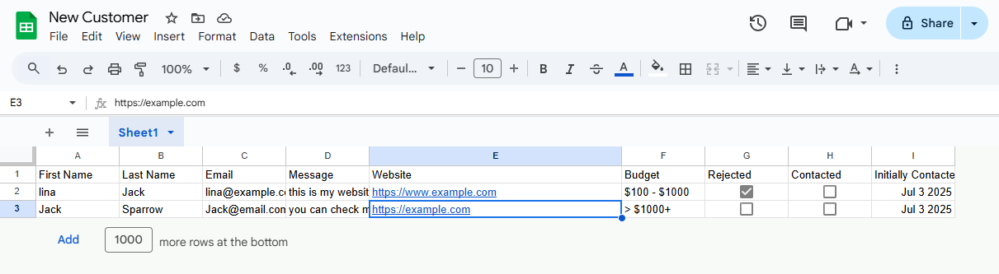
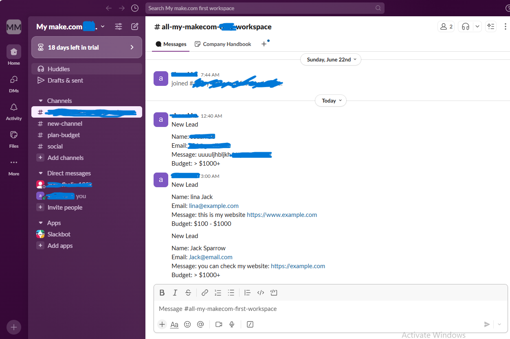
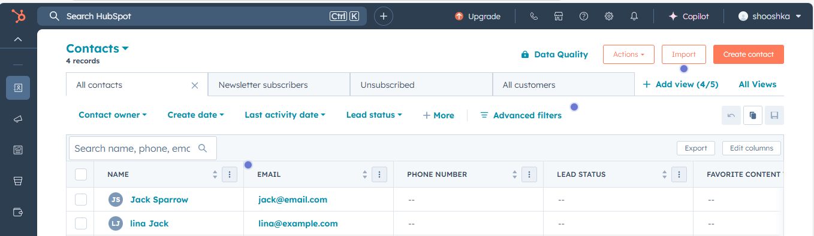

# 🧠 Lead Intake Automation

A Make.com-powered automation that handles new leads submitted via Google Forms and syncs them to Slack, HubSpot CRM, and Google Sheets.

## 🔧 What It Does

- Captures form submissions
- Logs leads to Google Sheets
- Sends email confirmation
- Sends Slack notification
- Creates a new contact in HubSpot

## 💡 Features

- Timestamp tracking
- Error handling for missing fields
- Works with free tools (Google Sheets, Slack, HubSpot CRM)

## 🛠 Tools Used

| Tool        | Purpose                   |
|-------------|---------------------------|
| Make.com    | Automation orchestrator   |
| Google Sheets | Lead logging             |
| HubSpot CRM | Lead management           |
| Slack       | Internal notifications    |
| Gmail       | Email confirmation        |

## 🧪 Sample Workflow

## 📁 Files

- `Lead Intake Automation.blueprint.json`: Import this into Make.com.
- `screenshots/`: Visuals showing the automation in action.

## ✅ Setup Steps

1. Create a Google Form and connect it to a Google Sheet.
2. Set up Slack Webhook (or Slack Bot).
3. Connect Make.com to Google, Slack, and HubSpot.
4. Import the `.blueprint.json` file into Make.com.
5. Update the field mappings as needed.
6. Run the scenario and test.
